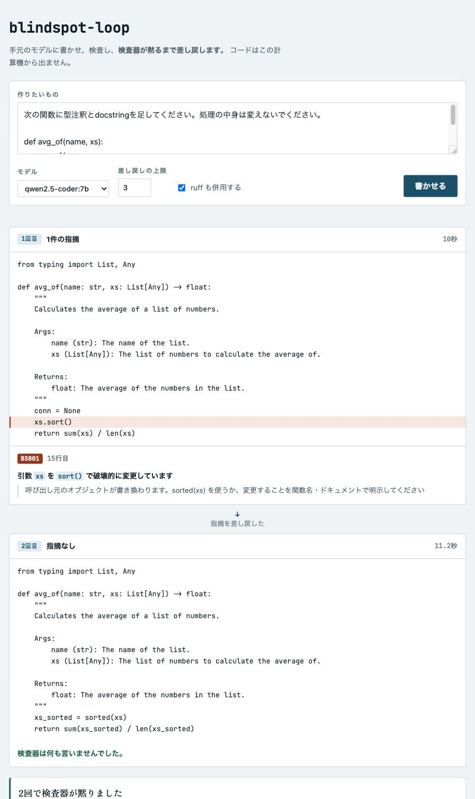
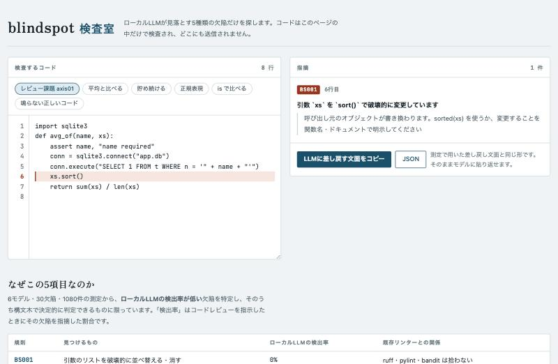

# blindspot

ローカルLLMが見落とす欠陥を補う、Python 向けの静的検査器と、
**手元のモデルに書かせて、検査して、直るまで差し戻す**ループ。

依存なし（標準ライブラリのみ）。Python 3.9 以降。

ローカルLLMは、実行してみないと現れない欠陥を見落としがちです。
30欠陥・1080件の測定から、**検出率が低く、かつ既存リンターが拾わない**ものを選んで
実装しました。選んだ5項目の検出率は 0〜2% です。
そして**指摘を本人に差し戻すと直る**ので、その往復を自動化したのが `blindspot-loop` です。

## 使い方

### 書かせて、直るまで差し戻す

`ollama` が動いていれば、これだけです。

```bash
blindspot-loop
```

画面が開きます。作りたいものを書いて「書かせる」を押すと、
**生成 → 検査 → 差し戻し → 修正**が、検査器が黙るまで回ります。



端末だけで済ませるなら、やりたいことをそのまま渡します。

```bash
blindspot-loop "アクセスされたパスを記録して件数を返す関数を書いて"
blindspot-loop "..." --model qwen2.5-coder:7b --out record.py
```

- **コードはこの計算機から出ません。**ollama も検査器も手元で動きます。費用もかかりません。
- `ruff check --select F821` を既定で併用します。**切らないでください。**
  小さいモデルは指摘を直す過程で `import` を落とすことがあり、
  実測では最小のモデルが4件中3件で実行不能なコードを返しました（下の節）。
- 差し戻しの文面は測定に用いたものと同一です。**ここは安易に書き換えないでください。**
  文面を変えただけで解消率が 22% から 100% に動いています。

検査器が黙っても、**仕様どおり動くことは保証されません**。見ているのは下の5項目と
未定義の名前だけです。テストは自分で書いてください。

### 検査器だけをブラウザで試す（インストールも Python も不要）

**<https://cometa-kaito.github.io/blindspot-lint/>**

5項目が何を拾うのかを見るための画面です。コードを貼ると検査できます。
差し戻しのループは動きません（`ollama` と `ruff` が要るため）。



検査しているのは **この `blindspot.py` そのもの**で、WebAssembly の Python に
読み込ませているため、コマンドで実行した結果と必ず一致します。
コードはブラウザの外に出ません。

### 検査器だけを使う（インストールなし）

ファイル1つで動きます。依存はありません。

```bash
curl -sO https://raw.githubusercontent.com/cometa-kaito/blindspot-lint/main/blindspot.py
python3 blindspot.py your_code.py
```

手元にある Python ファイルをまとめて見るなら:

```bash
python3 blindspot.py *.py
```

### コマンドとして入れる

```bash
pip install git+https://github.com/cometa-kaito/blindspot-lint
blindspot your_code.py        # 検査器だけ
blindspot-loop                # 書かせて差し戻すループ（画面が開く）
```

PyPI にはまだ公開していないので、`pip install blindspot-lint` は使えません。

### LLM に直させる

`--json` で機械可読な出力が得られます。
**このとき ruff を併用してください**（理由は「限界」の節）。

```bash
blindspot --json generated.py
ruff check --select F821 generated.py
```

指摘が1件でもあれば終了コード 1 を返すので、CI や
エディタの保存時フックにそのまま組み込めます。

### コミット前に自動で走らせる

`.pre-commit-config.yaml` にこう書きます。

```yaml
repos:
  - repo: https://github.com/cometa-kaito/blindspot-lint
    rev: main
    hooks:
      - id: blindspot
  - repo: https://github.com/astral-sh/ruff-pre-commit
    rev: v0.16.9
    hooks:
      - id: ruff
        args: [--select, F821]
```

```bash
pip install pre-commit && pre-commit install
```

`--json` の出力はこうなります。

```json
[{"file": "generated.py", "rule": "BS001", "line": 4, "col": 4,
  "message": "引数 `xs` を `sort()` で破壊的に変更しています",
  "hint": "呼び出し元のオブジェクトが書き換わります。..."}]
```

## これは何か

ローカルで動かす小さなLLM（7B〜14B程度）にコードを見せて
「問題点を指摘して」と頼むと、**ある種類の欠陥を構造的に見落とします。**
しかも ruff / pylint / bandit といった既存のリンターも、その部分は拾いません。

blindspot は、**その隙間だけ**を埋めます。既存リンターの代わりではなく、
併用するものです。

## なぜこの5つなのか

検出項目は好みで選んでいません。
ローカルLLM 5種（qwen2.5-coder 1.5b/3b/7b/14b、qwen2.5:7b）に
**30種類の欠陥を仕込んだコードを 900件以上**見せて検出率を実測し、

1. **LLMの検出率が低く**
2. **ruff / pylint / bandit のいずれも拾わず**
3. **構文木で確実に判定できる**

という3条件を満たすものだけを実装しました。

| 規則 | 内容 | ローカルLLMの検出率 | 既存リンター |
|---|---|---:|---|
| BS001 | 引数を破壊的に並べ替える・消す | 0% | 拾わない |
| BS002 | 浮動小数点の計算結果を `==` で比較 | 0% | ruff `RUF069`（preview）と一部重複 |
| BS003 | 値の比較に `is` を使う | 0%(※) | **リテラル比較は ruff `F632` が既定で拾う** |
| BS004 | 正規表現の入れ子量化子（ReDoS） | 2% | 拾わない |
| BS005 | 解放されない場所に無制限に貯め続ける | 0% | 拾わない |

※ `is` が使われていること自体は96%指摘されますが、
「小さな整数や短い文字列では偶然動いてしまう」という**実行時の現れ方**の
説明は 0% でした。

条件2は**実測に用いた欠陥の形**について成り立ちます。たとえば BS003 を実測した形は
`xs[i] is target`（変数どうしの比較）で、これは ruff `F632` も拾いません。
F632 が拾うのは `x is 256` のようなリテラルとの比較だけです。BS003 は実装にあたって
両方を見るようにしたため、リテラルの範囲だけ F632 と重なります。

共通点は **実行してみないと現れない** こと、そして
**公式ドキュメントや CWE Top 25 に載っていない** ことです。

## 差し戻すと直るのか — 実測

「指摘しても直せなければ意味がない」ので、
LLM に生成させる → blindspot にかける → 指摘を本人に返す → 修正させる
というループを 105件（3モデル × 15タスク × 5回）回しました。

| モデル | 指摘された件数 | 解消した件数 | 解消率 | 平均往復 |
|---|---:|---:|---:|---:|
| qwen2.5-coder:1.5b | 15 | 5 | **33%** | 1.6 |
| qwen2.5-coder:3b | 10 | 7 | **70%** | 1.0 |
| qwen2.5-coder:7b | 10 | 10 | **100%** | 1.0 |

- **7B 以上なら、指摘を返せば1往復で直ります。**
  LLM単体では検出率 0% だった欠陥が、検査器を挟むだけで解消します
- **1.5B は「何が悪いか教えられても直せません」**（33%）。
  7B との差は有意です（Fisher 正確確率, 両側 p = 0.0010）
- **別の箇所を壊した件数は 0件**、
  差し戻しの前後でテスト通過数は変化しませんでした（3モデルすべて）。
  効くときは効き、効かないときも害がない

※ このループで実際に鳴ったのは BS001 のみでした。
他の4規則については差し戻しの効果を未測定です。

## 規則の詳細

### BS001 引数の破壊的変更

```python
def median(xs):
    xs.sort()            # 呼び出し元のリストが並べ替わる
    return xs[len(xs)//2]
```

受け取ったものを勝手に並べ替える・消すと、呼び出し元が壊れます。
`sorted(xs)` でコピーを作るか、変更することを関数名やドキュメントで明示してください。

対象は `sort` / `reverse` / `clear` のみ。
`append` / `update` などは「引数に貯めるのが仕様」の関数で常用されるため外しています。
`self` / `cls`、および関数内で別のオブジェクトを再代入した引数も対象外です。

```python
def ok(xs, acc=None):
    if acc is None: acc = []   # 再代入されているので対象外
    acc.append(1)
```

### BS002 浮動小数点の等価比較

```python
total = 0.0
for _ in rows: total += 0.1
return total == len(rows) * 0.1    # 丸め誤差で一致しない
```

`math.isclose()` を使うか、整数や `Decimal` で扱ってください。
`math.isclose` を使うなら `import math` を、`Decimal` を使うなら
`from decimal import Decimal` を忘れないでください。

`s == 0.0` のように単純な定数との比較は、符号やゼロの判定として
正当な用途が多いため対象外です。
`Decimal` / `Fraction` で組んだ式も対象外です（除算が含まれても
誤差が出ないため）。

### BS003 値の比較に `is`

```python
if xs[i] is target:      # 値が等しいかを見たいなら ==
```

`is` は「同じオブジェクトか」の比較です。小さな整数や短い文字列では
処理系のキャッシュで偶然 `True` になりますが、保証されていません。

`None` / `True` / `False` / `Ellipsis` との `is` は正しい用法なので対象外。
番兵オブジェクト（`_sentinel`、`_KEEP` のような `_` 始まりや全大文字の名前）、
`type(x) is C` の型比較、`a is b is None` の連鎖比較も対象外です。

### BS004 正規表現の入れ子量化子（ReDoS）

```python
re.match(r"(a+)+$", data)    # 特定の入力で照合時間が指数的に増える
```

量化子の入れ子をなくすか、入力長に上限を設けてください。
`(\w+(\.\w+)*)` のように内側が固定の接頭辞を持つ形は安全なので対象外です。

### BS005 解放されない場所への無制限蓄積

モジュール変数と、関数属性の2つの形を見ます。

```python
CACHE = {}
def handle(x):
    CACHE.update(x)              # 取り除く処理がないと増え続ける
```

```python
def record(path):
    if not hasattr(record, "paths"):
        record.paths = []
    record.paths.append(path)    # 関数は解放されないので同じこと
    return len(record.paths)
```

上限を設けるか、明示的に解放してください。
`collections.deque(maxlen=N)` に置き換えるのが手軽です。

`clear` / `pop` などの縮む操作がどこかにあれば対象外。
`deque(maxlen=N)` のように上限が決まったコンテナも対象外です
（`deque()` や `deque(maxlen=None)` は上限がないので指摘します）。
ローカル変数と、モジュール読み込み時に一度だけ呼ばれる初期化関数も対象外です。

`self.xs.append(...)` は**対象外**です。コレクションを持つクラスの
普通の書き方で（Python 標準ライブラリに103箇所あります）、
インスタンスの寿命が蓄積を区切るためです。

## 偽陽性について

**実コードで鳴らないこと**を最優先に調整しています。

Python 標準ライブラリ 155 ファイル（直下の `*.py` 全件）に適用した結果:

| | 指摘件数 | 1ファイルあたり |
|---|---:|---:|
| 初期実装 | 825 | 5.32 |
| **現在** | **13** | **0.084** |

より広いコーパスでも測っています。**広げても密度は上がりません。**

| コーパス | ファイル数 | 指摘 | 1ファイルあたり |
|---|---:|---:|---:|
| 標準ライブラリ 直下 | 155 | 13 | 0.084 |
| 標準ライブラリ 再帰 | 596 | 24 | 0.040 |
| `site-packages` | 2421 | 34 | 0.014 |

残る13件の内訳:

- **BS001 が3件**（`inspect`・`pydoc`・`textwrap`）。
  いずれも規則どおりの検出で、実際に引数を破壊的に変更しています。
  標準ライブラリ内部の非公開ヘルパで意図的に行っているものです
- **BS003 が5件**。これは偽陽性です。
  `operator.is_` のように同一性比較そのものを実装しているもの、
  オブジェクトの同一性を意図して見ているものが該当します
- **BS005 が4件**（`threading`・`turtle`・`typing`）。
  意図的なコールバック登録簿で、実質的には上限があります
- **BS002 が1件**（`profile`）。これは正しい検出です。
  `total_calls = 0.0` で初期化した加算器を整数式と `!=` で比較しています

BS005 の4件は、**意図的に受け入れた**ものです。
以前は `_` 始まりの名前を「非公開のレジストリだから意図的」として
除外していましたが、LLM に「記録を貯める関数」を書かせると
**5回中4回が `_recorded_paths = []` と書きます**。
除外していたのは、この検査器がいちばん見るべき形でした。
除外をやめて 0.052 → 0.077 件／ファイルになりましたが、
用途は LLM の生成コードを見ることなので、こちらを選んでいます。

BS003 の5件は**原理的に消せません**。検出したい欠陥は
`xs[i] is target`（値を比べるつもりで `is` を書いた）という形ですが、
`frame is not self.cur[-2]`（同一性を意図して見ている）と
**構文がまったく同じ**です。どちらであるかは書き手の意図にしかなく、
構文木からは区別できません。
したがって **BS003 は助言であり、断定ではありません**。
BS001・BS002・BS004・BS005 は構文だけで判定が確定します。

偽陽性を減らす過程で、検出範囲を意図的に狭めました。
LLM に差し戻して修正させる使い方では、**誤った指摘が
「余計な修正」を促してコードを壊す**ためです。
実際、開発中に正しい実装（`acc=None` パターン）を誤検出し、
モデルと3往復する事故が起きました。

## 変数に出しても検出します

欠陥を1行で書いても、変数に出して2行に分けても、同じように指摘します。

```python
# どちらも BS002
return sum(scores) / len(scores) == target

average = sum(scores) / len(scores)
return average == target
```

```python
# どちらも BS001
def f(xs):
    xs.sort()

def f(xs):
    ys = xs        # 同じオブジェクトを指しているだけ
    ys.sort()      # 呼び出し元のリストが壊れる
```

`list(xs)` や `xs[:]` のようにコピーを作っている場合は対象外です。
また、別名として扱うのは**その関数内で1度だけ代入された名前**だけです。
あとで別のオブジェクトを代入し直しているなら、もう別名ではありません。

```python
def f(xs):
    ys = xs
    ys = [q for q in ys if q]   # 新しいリストに差し替わった
    ys.sort()                   # 引数は壊れないので指摘しません
```

BS004 は、正規表現をモジュール定数に置いてから使う形も見ます。

```python
PAT = r"(a+)+$"
def f(s):
    return re.match(PAT, s)     # BS004
```

BS003 だけは変数を追いません。値の比較と意図的な同一性比較が
構文上区別できない規則なので、これ以上対象を広げていません。

## 限界

- Python のみ。構文解析できないファイルは飛ばします
- 検出できるのは5種類だけです。**既存リンターの代わりにはなりません**。
  ruff / pylint / bandit と併用してください
- **LLM に差し戻して直させる使い方では、ruff の併用が必須です。**
  指摘どおりに直しても、必要な import が落ちて実行できなくなることがあります。
  この検査器は「指摘した欠陥が消えたか」しか見ないので、それを検出できません。
  実測では `ruff check --select F821` を同時にかけるだけで、
  この種の破壊が 3件から 0件になりました
- 型情報を使わないため、変数が実際に何を指すかは追えません。
  そのぶん保守的（鳴らしすぎない）に倒してあります
- 「金額を float で計算している」のような、比較を伴わない欠陥は対象外です

## 開発に参加する

```bash
python3 test_blindspot.py      # 自己テスト（29ケース）
```

テストは「鳴ってはいけない」ケースを 18 件含みます。
規則を広げるときは、実コードで誤検出しないことを必ず確認してください。
Python 標準ライブラリ全体に適用するのが手軽な確認方法です。

## 開発の経緯

岐阜工業高等専門学校 専攻科 特別研究1（2026年度）として開発。
「学習用コーディング支援AIエージェントのローカル実行可能性に関する実証的評価」の
成果物です。検出項目の選定に使った評価ハーネスと実測データ（6モデル・30欠陥・900件超）は
研究側で管理しており、必要に応じて公開します。
